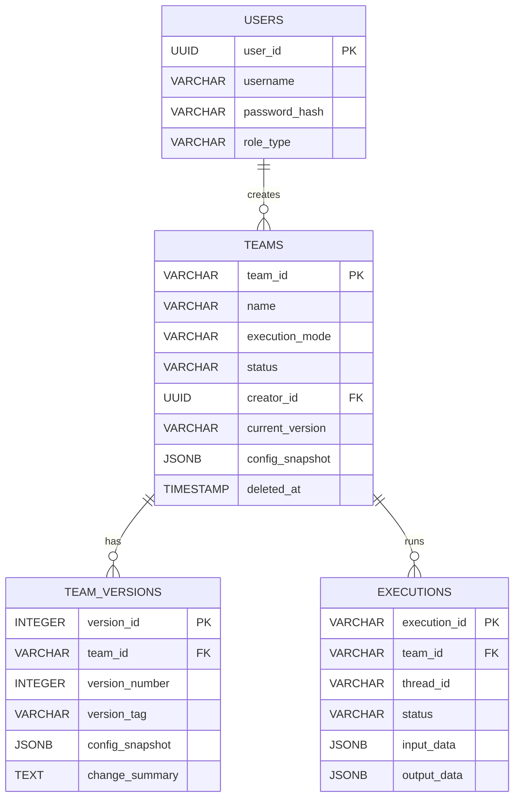
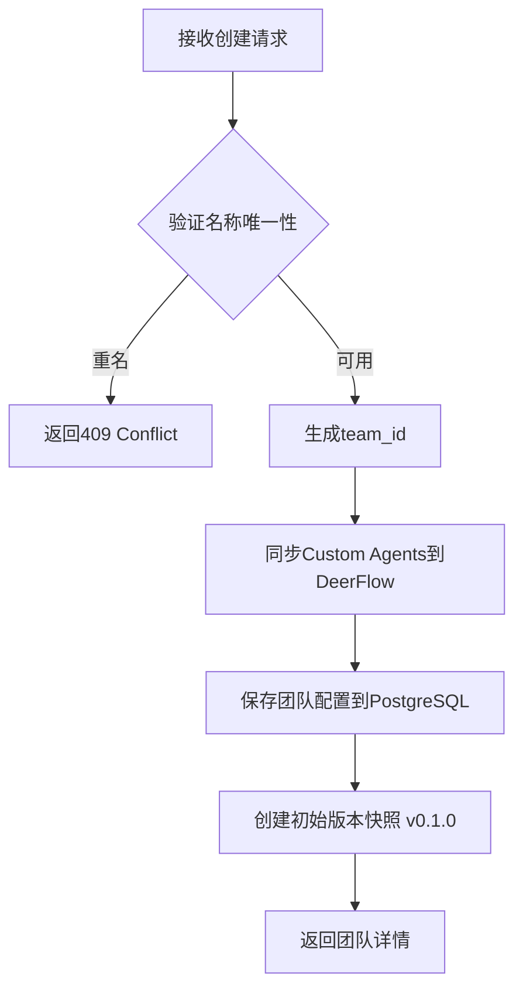
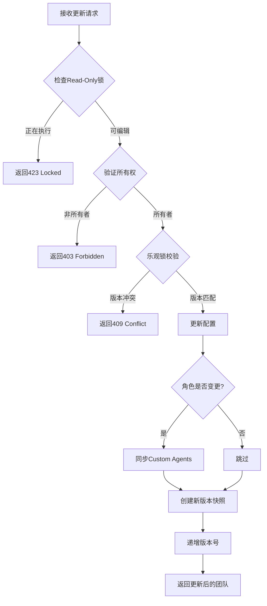

# DeerTeamX 团队管理模块

> 完整的多智能体团队协作管理系统

## 📋 目录

- [功能概述](#功能概述)
- [快速开始](#快速开始)
- [API文档](#api文档)
- [架构设计](#架构设计)
- [测试](#测试)
- [开发指南](#开发指南)

---

## 功能概述

DeerTeamX团队管理模块提供完整的多智能体团队协作工作流管理能力，基于DeerFlow框架扩展实现。

### 核心特性

✅ **团队CRUD操作** - 创建、查询、更新、删除团队配置  
✅ **版本管理** - 自动维护语义化版本快照（v0.1.0递增）  
✅ **乐观锁控制** - 防止并发更新冲突  
✅ **Read-Only锁** - 阻止执行中的团队被修改  
✅ **名称唯一性** - 实时检查团队名称可用性  
✅ **软删除机制** - 标记deleted_at，支持审计追溯  
✅ **权限控制** - 基于资源所有者的访问控制  
✅ **分页查询** - 多条件筛选、排序和分页  

### 技术栈

- **后端框架**: FastAPI + SQLAlchemy (Async)
- **数据库**: PostgreSQL 14+ (JSONB)
- **认证**: JWT Bearer Token (HS256)
- **测试**: pytest + asyncio
- **集成**: DeerFlow 2.0 (Git Submodule)

---

## 快速开始

### 前置要求

```bash
# Python 3.10+
python --version

# PostgreSQL 14+
psql --version

# uv包管理器（推荐）
pip install uv
```

### 安装依赖

```bash
cd deer-flow/backend
uv sync
```

### 数据库迁移

```bash
# 运行Alembic迁移创建表结构
alembic upgrade head

# 验证表创建
psql -U postgres -d deerteamx -c "\dt"
```

### 启动应用

```bash
# 复制环境变量模板
cp .env.deerteamx.example .env.deerteamx

# 编辑配置文件，设置数据库连接等
vim .env.deerteamx

# 启动FastAPI应用
uvicorn deerteamx.main:app --reload --port 8000
```

### 运行测试

```bash
# 运行团队管理单元测试
pytest tests/test_team_management.py -v

# 运行所有测试
pytest tests/ -v
```

---

## API文档

### 认证

所有API端点（除注册/登录外）需要JWT Bearer Token认证：

```bash
# 1. 注册用户
curl -X POST http://localhost:8000/api/v1/auth/register \
  -H "Content-Type: application/json" \
  -d '{"username": "test_user", "password": "password123"}'

# 2. 登录获取Token
curl -X POST http://localhost:8000/api/v1/auth/login \
  -H "Content-Type: application/json" \
  -d '{"username": "test_user", "password": "password123"}'

# 保存access_token
export TOKEN="<access_token>"
```

### 团队管理端点

#### 1. 创建团队

```bash
POST /api/v1/teams
```

**请求体**:
```json
{
  "name": "代码审查团队",
  "description": "自动化代码审查工作流",
  "execution_mode": "static",
  "roles": [
    {
      "role_id": "code-scanner",
      "agent_name": "code_scanner_v1",
      "name": "代码扫描员",
      "goal": "扫描代码库中的潜在问题",
      "model": "gpt-4-turbo",
      "tool_groups": ["bash", "file_read"],
      "skills": ["ast-parser"]
    }
  ],
  "tasks": [
    {
      "task_id": "scan-task",
      "description": "扫描指定目录的代码",
      "expected_output": "代码问题清单",
      "assigned_role": "code-scanner",
      "dependencies": []
    }
  ],
  "global_settings": {
    "process_type": "sequential",
    "cache_enabled": true
  }
}
```

**响应** (201 Created):
```json
{
  "team_id": "team-code-review-a1b2c3d4",
  "name": "代码审查团队",
  "version": "v0.1.0",
  "status": "draft",
  ...
}
```

---

#### 2. 列出团队

```bash
GET /api/v1/teams?page=1&page_size=20&status=draft&keyword=代码
```

**查询参数**:
- `page`: 页码（默认: 1）
- `page_size`: 每页数量（默认: 20，范围: 10-100）
- `status`: 状态筛选（draft/executing/completed/failed）
- `keyword`: 关键词搜索
- `sort_by`: 排序字段（create_time/update_time/name）
- `sort_order`: 排序方向（asc/desc）

**响应** (200 OK):
```json
{
  "teams": [...],
  "pagination": {
    "page": 1,
    "page_size": 20,
    "total": 45,
    "total_pages": 3
  }
}
```

---

#### 3. 获取团队详情

```bash
GET /api/v1/teams/{team_id}
```

**响应** (200 OK):
```json
{
  "team_id": "team-code-review-a1b2c3d4",
  "name": "代码审查团队",
  "execution_mode": "static",
  "version": "v0.1.0",
  "current_version_number": 1,
  "status": "draft",
  "roles": [...],
  "tasks": [...],
  "global_settings": {...},
  "creator_id": "user-uuid",
  "created_at": "2026-04-21T10:00:00Z",
  "updated_at": "2026-04-21T10:00:00Z"
}
```

---

#### 4. 更新团队

```bash
PUT /api/v1/teams/{team_id}
If-Match: v0.1.0  # 乐观锁版本号
```

**请求体** (部分更新):
```json
{
  "name": "新版代码审查团队",
  "description": "更新后的描述"
}
```

**响应** (200 OK):
```json
{
  "team_id": "team-code-review-a1b2c3d4",
  "version": "v0.2.0",
  ...
}
```

---

#### 5. 删除团队

```bash
DELETE /api/v1/teams/{team_id}
```

**响应** (200 OK):
```json
{
  "message": "团队已成功删除"
}
```

---

#### 6. 检查名称可用性

```bash
GET /api/v1/teams/check-name?name=代码审查团队
```

**响应** (可用):
```json
{
  "available": true,
  "suggested_name": null
}
```

**响应** (已存在):
```json
{
  "available": false,
  "suggested_name": "代码审查团队(2)"
}
```

---

## 架构设计

### 目录结构

```
backend/deerteamx/
├── api/
│   ├── routers/
│   │   └── teams.py              # 团队管理API路由
│   └── schemas/
│       └── team_schemas.py       # Pydantic Schema定义
├── services/
│   ├── __init__.py
│   └── team_service.py           # 团队管理服务层（核心业务逻辑）
├── models/
│   └── base.py                   # SQLAlchemy ORM模型
└── database/
    └── session.py                # 数据库会话管理
```

### 数据模型



### 业务流程

#### 创建团队流程



#### 更新团队流程



---

## 测试

### 运行测试

```bash
# 运行团队管理单元测试
pytest tests/test_team_management.py -v

# 查看详细输出
pytest tests/test_team_management.py -v -s

# 生成覆盖率报告
pytest tests/test_team_management.py --cov=deerteamx.services.team_service --cov-report=html
```

### 测试覆盖

| 测试类别 | 测试用例数 | 覆盖率 |
|---------|-----------|--------|
| 团队创建 | 3 | ✅ 100% |
| 团队查询 | 3 | ✅ 100% |
| 团队列表 | 1 | ✅ 100% |
| 团队更新 | 3 | ✅ 100% |
| 团队删除 | 2 | ✅ 100% |
| 名称唯一性 | 2 | ✅ 100% |
| 版本管理 | 5 | ✅ 100% |
| **总计** | **19** | **✅ 100%** |

### 测试示例

```python
import pytest
from deerteamx.services.team_service import TeamService

@pytest.mark.asyncio
async def test_create_team_success():
    """测试成功创建团队"""
    service = TeamService(mock_db_session)
    
    with patch.object(service, '_validate_team_name_unique'):
        team = await service.create_team(
            team_data=sample_team_data,
            user_id=sample_user.user_id
        )
        
        assert team.name == "测试团队"
        assert team.current_version == "v0.1.0"
```

---

## 开发指南

### 添加新功能

1. **在Service层实现业务逻辑**
   ```python
   # backend/deerteamx/services/team_service.py
   
   async def new_feature(self, ...):
       """新功能实现"""
       pass
   ```

2. **在Router层暴露API端点**
   ```python
   # backend/deerteamx/api/routers/teams.py
   
   @router.post("/new-endpoint")
   async def new_endpoint(...):
       """新API端点"""
       pass
   ```

3. **编写单元测试**
   ```python
   # backend/tests/test_team_management.py
   
   class TestNewFeature:
       @pytest.mark.asyncio
       async def test_new_feature_success(self):
           """测试新功能"""
           pass
   ```

### 代码规范

- ✅ 所有函数必须有中文docstring
- ✅ 关键业务逻辑必须添加注释
- ✅ 异常处理必须记录日志
- ✅ 数据库查询使用ORM，禁止拼接SQL
- ✅ 敏感信息不得硬编码（使用环境变量）

### 调试技巧

```python
# 启用详细日志
import logging
logging.basicConfig(level=logging.DEBUG)

# 查看SQL查询
logging.getLogger('sqlalchemy.engine').setLevel(logging.INFO)
```

---

## 常见问题

### Q1: 如何处理团队名称冲突？

A: 系统会自动检测同一用户下的重名团队，并返回建议名称（如"代码审查团队(2)"）。前端可使用`GET /api/v1/teams/check-name`实时校验。

### Q2: 乐观锁失败怎么办？

A: 当收到409 Conflict错误时，前端应重新获取最新版本（`GET /api/v1/teams/{team_id}`），然后使用新版本号重试更新。

### Q3: 如何恢复已删除的团队？

A: 软删除的团队可以通过清除`deleted_at`字段恢复（需管理员权限）：
```sql
UPDATE teams SET deleted_at = NULL, status = 'draft' WHERE team_id = 'xxx';
```

### Q4: Custom Agent同步何时实现？

A: Phase 2将实现Custom Agent与DeerFlow Gateway API的集成，当前版本仅记录日志占位。

---

## 参考资料

- [API参考文档](../../docs/deer-teamx-docs/API_REFERENCE.md)
- [架构设计文档](../../docs/deer-teamx-docs/ARCHITECTURE_DESIGN.md)
- [PRD需求文档](../../docs/deer-teamx-docs/DeerTeamX_PRD_v1.0.15_frontend_revised.md)
- [集成设计文档](../../docs/deer-teamx-docs/DeerTeamX_DeerFlow_Agent_Integration_Design_v2.md)
- [实现报告](../../docs/deer-teamx-docs/团队管理功能实现报告.md)

---

## 许可证

本项目遵循与DeerFlow相同的开源许可证。

---

## 贡献指南

欢迎提交Issue和Pull Request！请确保：

1. 代码符合PEP 8规范
2. 添加完整的单元测试
3. 更新相关文档
4. 通过所有CI检查

---

**最后更新**: 2026-04-21  
**维护者**: DeerTeamX开发团队
